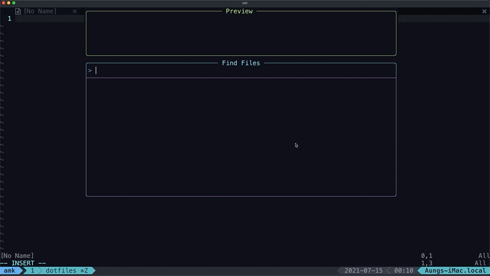

# {.}files

> My NEOVim, tmux and zsh config

[![dotfiles][dotfiles]][dotfiles-url]
[![env][env]][env-url]
[![term][term]][term-url]
[![editor][editor]][editor-url]
[![multiplexer][multiplexer]][multiplexer-url]
[![shell][shell]][shell-url]
[![License: MIT][license]][license-url]
[![Docker Cloud Build Status][docker-build-status]][docker-build-url]

---



---

_i have switched to init.lua_

- [PREREQUISITES](#PREREQUISITES)
  - [Install TMUX](#install-tmux)
  - [Install TMUX Plugin Manager](#install-tmux-plugin-manager)
  - [Install NEOVIM](#install-neovim)
  - [Install NEOVIM Plugin](#install-neovim-plugin)
- [INSTALLATION](#INSTALLATION)
  - [Install Config](#install-config)
  - [Install TMUX Plugins](#install-tmux-plugins)
  - [❄️](#❄️)
- [LICENSE](#LICENSE)

---

## PREREQUISITES

### Install [TMUX](https://tmux.github.io/)

```shell
brew install tmux
```

### Install [TMUX Plugin Manager](https://github.com/tmux-plugins/tpm)

```shell
git clone https://github.com/tmux-plugins/tpm ~/.tmux/plugins/tpm
```

### Install [NEOVIM](https://neovim.io)

```shell
brew install neovim
```

### Install NEOVIM Plugin

```
:PackerInstall
```

---

_[Z shell](https://github.com/robbyrussell/oh-my-zsh/wiki/Installing-ZSH) and [antibody](https://github.com/getantibody/antibody) should also need to be installed._

---

## INSTALLATION

### Install Config

```shell
git clone git@github.com:AungMyoKyaw/dotfiles.git
cd dotfiles
sh ./install.sh
```

### Install [TMUX](https://tmux.github.io/) Plugins

Use <kbd>ctrl</kbd>+<kbd>a</kbd>+<kbd>I</kbd> to install [TMUX](https://tmux.github.io/) Plugins

_<kbd>ctrl+a</kbd> is `prefix`._

### Install [ZSH](https://www.zsh.org/) Plugins

#### reload zshrc

```shell
source ~/.zshrc
```

#### updateplugin

```shell
updateplugin
```

## Dockerized Vim [docker hub]

```shell
docker run -it --rm \
  -v $(pwd):/root/src:cached \
  aungmyokyaw/dnvim
```

## Dockerized Vim [local]

### Build Dockerfile

```shell
docker build -t dnvim .
```

### Develop with dnvim

##### set alias

```shell
alias dnvim='docker run -it --rm \
  -v $(pwd):/root/src:cached \
  dnvim'
```

##### and run

```shell
dnvim
```

##### or run manually

```shell
docker run -it --rm \
  -v $(pwd):/root/src:cached \
  dnvim
```

### ❄️

- install [hammerspoon](https://www.hammerspoon.org)
- install [karabiner](https://karabiner-elements.pqrs.org)
- install [luarocks](https://luarocks.org)
- install [faker](https://luarocks.org/modules/hectorvido/faker),[date](https://luarocks.org/modules/tieske/date)

## LICENSE

MIT © [Aung Myo Kyaw](https://github.com/AungMyoKyaw)

[screenshot]: ./assets/screenshot.png
[license]: https://img.shields.io/badge/License-MIT-brightgreen.svg?style=flat-square
[license-url]: https://opensource.org/licenses/MIT
[dotfiles]: https://img.shields.io/badge/{.}files-AMK-brightgreen.svg?style=flat-square
[dotfiles-url]: #
[term]: https://img.shields.io/badge/term-iterm2-brightgreen.svg?style=flat-square
[term-url]: https://iterm2.com
[env]: https://img.shields.io/badge/env-macOS-brightgreen.svg?style=flat-square
[env-url]: https://www.apple.com/macos
[editor]: https://img.shields.io/badge/editor-neovim-brightgreen.svg?style=flat-square
[editor-url]: https://neovim.io
[multiplexer]: https://img.shields.io/badge/multiplexer-tmux-brightgreen.svg?style=flat-square
[multiplexer-url]: https://github.com/tmux/tmux/wiki
[shell]: https://img.shields.io/badge/shell-zsh-brightgreen.svg?style=flat-square
[shell-url]: https://zsh.sourceforge.io
[asciicast-screenshot]: https://asciinema.org/a/LrBeUcO83YmxixOFCTBi8sQIT.svg
[asciicast-screenshot-url]: https://asciinema.org/a/LrBeUcO83YmxixOFCTBi8sQIT
[docker-build-status]: https://img.shields.io/docker/cloud/build/aungmyokyaw/dnvim?style=flat-square
[docker-build-url]: https://hub.docker.com/r/aungmyokyaw/dnvim
