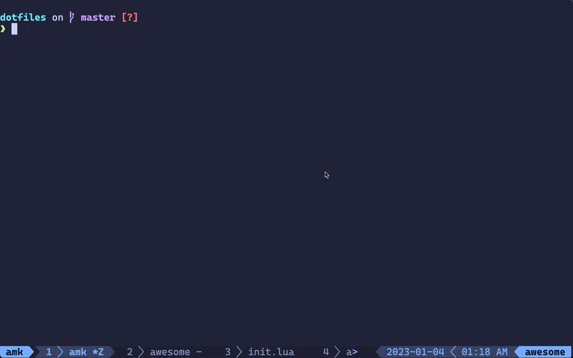

# (.)files

> My NEOVim, tmux and zsh config

[![dotfiles][dotfiles]][dotfiles-url]
[![env][env]][env-url]
[![term][term]][term-url]
[![editor][editor]][editor-url]
[![multiplexer][multiplexer]][multiplexer-url]
[![shell][shell]][shell-url]
[![License: MIT][license]][license-url]

---

---

_i have switched to init.lua_

---

## LICENSE

MIT © [Aung Myo Kyaw](https://github.com/AungMyoKyaw)

[screenshot]: ./assets/screenshot.png
[license]: https://img.shields.io/badge/license-MIT-brightgreen.svg?style=for-the-badge
[license-url]: https://opensource.org/licenses/MIT
[dotfiles]: https://img.shields.io/badge/{.}files-AMK-brightgreen.svg?style=for-the-badge
[dotfiles-url]: #
[term]: https://img.shields.io/badge/term-alacritty-brightgreen.svg?style=for-the-badge&logo=alacritty
[term-url]: https://alacritty.org
[env]: https://img.shields.io/badge/env-macOS-brightgreen.svg?style=for-the-badge&logo=macos
[env-url]: https://www.apple.com/macos
[editor]: https://img.shields.io/badge/editor-nvim%200.5%2B-brightgreen.svg?style=for-the-badge&logo=neovim
[editor-url]: https://neovim.io
[multiplexer]: https://img.shields.io/badge/multiplexer-tmux-brightgreen.svg?style=for-the-badge&logo=tmux
[multiplexer-url]: https://github.com/tmux/tmux/wiki
[shell]: https://img.shields.io/badge/shell-zsh-brightgreen.svg?style=for-the-badge&logo=shell
[shell-url]: https://zsh.sourceforge.io
[asciicast-screenshot]: https://asciinema.org/a/LrBeUcO83YmxixOFCTBi8sQIT.svg
[asciicast-screenshot-url]: https://asciinema.org/a/LrBeUcO83YmxixOFCTBi8sQIT
