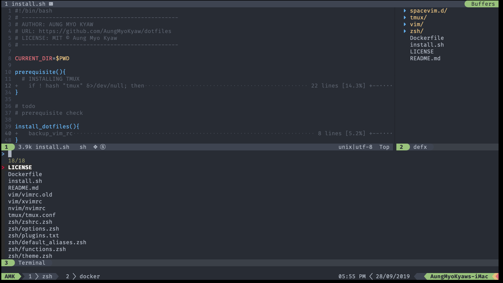

# [.]files

> My vim and tmux config



- [Prerequisites](#prerequisites)
  - [Install TMUX](#install-tmux)
  - [Install TMUX Plugin Manager](#install-tmux-plugin-manager)
  - [Install Terminal Font](#install-terminal-font)
  - [Install neovim](#install-neovim)
  - [Install spacevim-config](#install-spacevim-config)
- [Installation](#installation)
  - [Install Config](#install-config)
  - [Install TMUX Plugins](#install-tmux-plugins)
- [License](#license)

---

## Prerequisites

### Install [TMUX](https://tmux.github.io/)

```shell
brew install tmux
```

### Install [TMUX Plugin Manager](https://github.com/tmux-plugins/tpm)

```shell
git clone https://github.com/tmux-plugins/tpm ~/.tmux/plugins/tpm
tmux source ~/.tmux.conf
```

### Install Terminal Font

#### Install DejaVuSansMono [Nerd Font](https://github.com/ryanoasis/nerd-fonts) Mono

```shell
brew tap caskroom/fonts
brew cask install font-dejavusansmono-nerd-font-mono
```

Set Terminal Font to `DejaVuSansMono Nerd Font Mono`.

### Install [neovim](https://neovim.io/)

```shell
brew install neovim
```

### Install [spacevim config](https://spacevim.org/)

#### Linux and macOS

```shell
curl -sLf https://spacevim.org/install.sh | bash
```

---

_I recommend to use [iterm2](https://www.iterm2.com/)._

_[Z shell](https://github.com/robbyrussell/oh-my-zsh/wiki/Installing-ZSH) and [oh-my-zsh](https://github.com/robbyrussell/oh-my-zsh) should also be installed._

---

## Installation

### Install Config

```shell
git clone git@github.com:AungMyoKyaw/dotfiles.git
cd dotfiles
sh ./install.sh
```

### Install [TMUX](https://tmux.github.io/) Plugins

Use <kbd>ctrl</kbd>+<kbd>a</kbd>+<kbd>I</kbd> to install [TMUX](https://tmux.github.io/) Plugins

_<kbd>ctrl+a</kbd> is `prefix`._

## License

MIT © [Aung Myo Kyaw](https://github.com/AungMyoKyaw)
