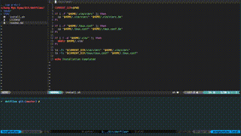

# [.]files

> My vim and tmux config



* [Prerequisites](#prerequisites)
  * [Install TMUX](#install-tmux)
  * [Install TMUX Plugin Manager](#install-tmux-plugin-manager)
  * [Install Vundle](#install-vundle)
  * [Install Terminal Font](#install-terminal-font)
  * [Install neovim](#install-neovim)
* [Installation](#installation)
  * [Install Config](#install-config)
  * [Install TMUX Plugins](#install-tmux-plugins)
  * [Install Vim Plugins](#install-vim-plugins)
* [Plugins](#plugins)
* [Acknowledgments](#acknowledgments)
* [License](#license)

---

## Prerequisites

### Install [TMUX](https://tmux.github.io/)

```shell
brew install tmux
```

### Install [TMUX Plugin Manager](https://github.com/tmux-plugins/tpm)

```shell
git clone https://github.com/tmux-plugins/tpm ~/.tmux/plugins/tpm
tmux source ~/.tmux.conf
```

### Install [Vundle](https://github.com/VundleVim/Vundle.vim)

```shell
git clone https://github.com/VundleVim/Vundle.vim.git ~/.vim/bundle/Vundle.vim
```

### Install Terminal Font

#### Install Knack [Nerd Font](https://github.com/ryanoasis/nerd-fonts)

```shell
brew tap caskroom/fonts
brew cask install font-sourcecodepro-nerd-font
```

Set Terminal Font to `Sauce Code Pro Nerd Font`.

### Install [neovim](https://neovim.io/)

```shell
brew install neovim
```

---

_I recommend to use [iterm2](https://www.iterm2.com/) with [oceanicmaterial color scheme](http://iterm2colorschemes.com/)._

_[Z shell](https://github.com/robbyrussell/oh-my-zsh/wiki/Installing-ZSH) and [oh-my-zsh](https://github.com/robbyrussell/oh-my-zsh) should also be installed._

---

## Installation

### Install Config

```shell
git clone git@github.com:AungMyoKyaw/dotfiles.git
cd dotfiles
sh ./install.sh
```

### Install [TMUX](https://tmux.github.io/) Plugins

Use <kbd>ctrl</kbd>+<kbd>a</kbd>+<kbd>I</kbd> to install [TMUX](https://tmux.github.io/) Plugins

_<kbd>ctrl+a</kbd> is `prefix`._

### Install [Vim](http://www.vim.org/) Plugins

_CMAKE is also needed to be installed `brew install cmake`_

```shell
vim +PluginInstall +qall
```

### Need a few more step to activate some plugins

#### YouCompleteMe

```shell
cd ~/.vim/bundle/YouCompleteMe
./install.py --all
```

#### ctrlsf

```shell
brew install ack
```

## Plugins

| Name                                                                | Description |
| ------------------------------------------------------------------- | ----------- |
| [BufOnly](http://github.com/vim-scripts/BufOnly.vim)                |             |
| [Vundle](http://github.com/VundleVim/Vundle.vim)                    |             |
| [ack](http://github.com/mileszs/ack.vim)                            |             |
| [auto-pairs ](http://github.com/jiangmiao/auto-pairs)               |             |
| [ctrlp-funky](http://github.com/tacahiroy/ctrlp-funky)              |             |
| [ctrlp](http://github.com/ctrlpvim/ctrlp.vim)                       |             |
| [ctrlsf](http://github.com/dyng/ctrlsf.vim)                         |             |
| [editorconfig-vim](http://github.com/editorconfig/editorconfig-vim) |             |
| [emmet-vim](http://github.com/mattn/emmet-vim)                      |             |
| [neodark](http://github.com/KeitaNakamura/neodark.vim)              |             |
| [nerdtree](http://github.com/scrooloose/nerdtree)                   |             |
| [tagbar](http://github.com/majutsushi/tagbar)                       |             |
| [ultisnips](http://github.com/SirVer/ultisnips)                     |             |
| [vim-airline](http://github.com/vim-airline/vim-airline)            |             |
| [vim-colortuner](http://github.com/zefei/vim-colortuner)            |             |
| [vim-commentary](http://github.com/tpope/vim-commentary)            |             |
| [vim-devicons](http://github.com/ryanoasis/vim-devicons)            |             |
| [vim-easy-align](http://github.com/junegunn/vim-easy-align)         |             |
| [vim-fold-cycle](http://github.com/arecarn/vim-fold-cycle)          |             |
| [vim-fugitive](http://github.com/tpope/vim-fugitive)                |             |
| [vim-gitgutter](http://github.com/airblade/vim-gitgutter)           |             |
| [vim-javascript](http://github.com/pangloss/vim-javascript)         |             |
| [vim-jsx](http://github.com/mxw/vim-jsx)                            |             |
| [vim-prettier](http://github.com/prettier/vim-prettier)             |             |
| [vim-snippets](http://github.com/honza/vim-snippets)                |             |
| [vim-surround](http://github.com/tpope/vim-surround)                |             |
| [vim-tmux](http://github.com/tmux-plugins/vim-tmux)                 |             |
| [vim-wakatime](http://github.com/wakatime/vim-wakatime)             |             |
| [yajs](http://github.com/othree/yajs.vim)                           |             |
| [youcompleteme](http://github.com/valloric/youcompleteme)           |             |

## Acknowledgments

Vimrc used in this project use a lot of config from [minimal-vimrc](https://github.com/mhinz/vim-galore/blob/master/static/minimal-vimrc.vim).

## License

[MIT](./LICENSE)
